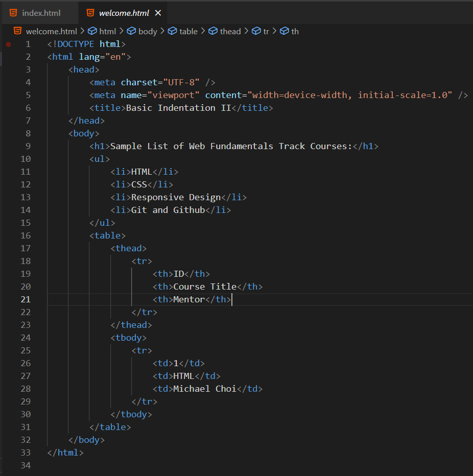
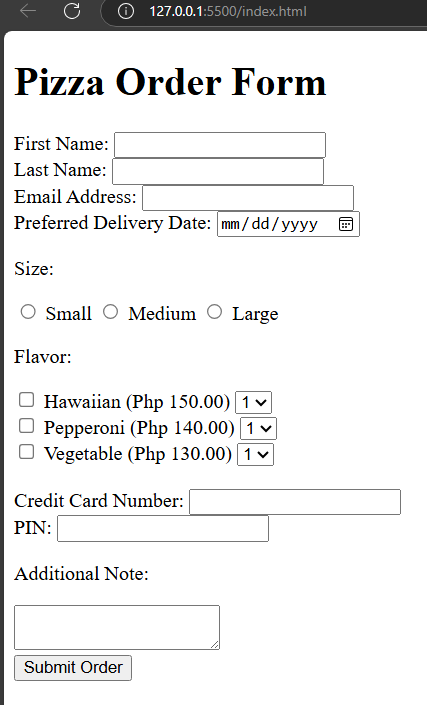

# Finished Assignment

Welcome! This repository contains individual assignments, each organized in its own branch. You can explore each assignment by switching branches to view the relevant code and any associated project previews.

## 1 Assignment: Practicing Indentation
Objectives
- To apply correct spacing
- To align opening, and closing tags

## 2 Assignment: Pizza Order Form
Objectives
- To focus on important-to-know form tags
- To check if the code conforms to standards using the validator
- To apply indentation

